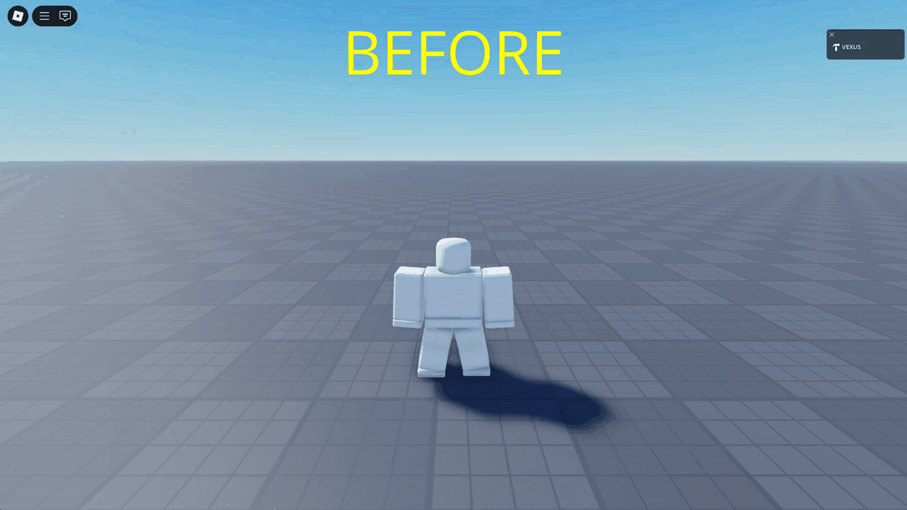

# Roblox TopBar Hider

RTH is an add-on for [Bloxstrap](https://github.com/bloxstraplabs/bloxstrap) that hides the Roblox TopBar menu for cleaner gameplay.

## Usage

1. Install [Bloxstrap](https://github.com/bloxstraplabs/bloxstrap).
2. Download the [latest release of RTH](https://github.com/vex5s/roblox-topbar-hider/releases/latest).
3. Run `RTH.bat`.
4. Select option 1.
5. Launch Roblox through [Bloxstrap](https://github.com/bloxstraplabs/bloxstrap).
